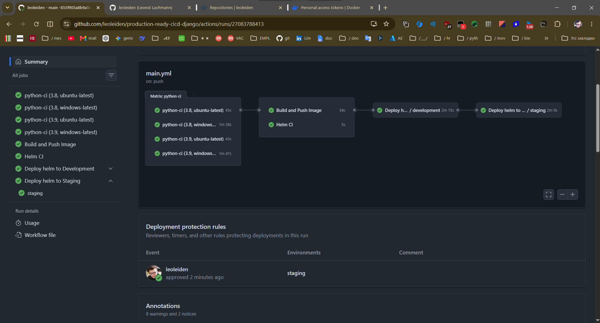
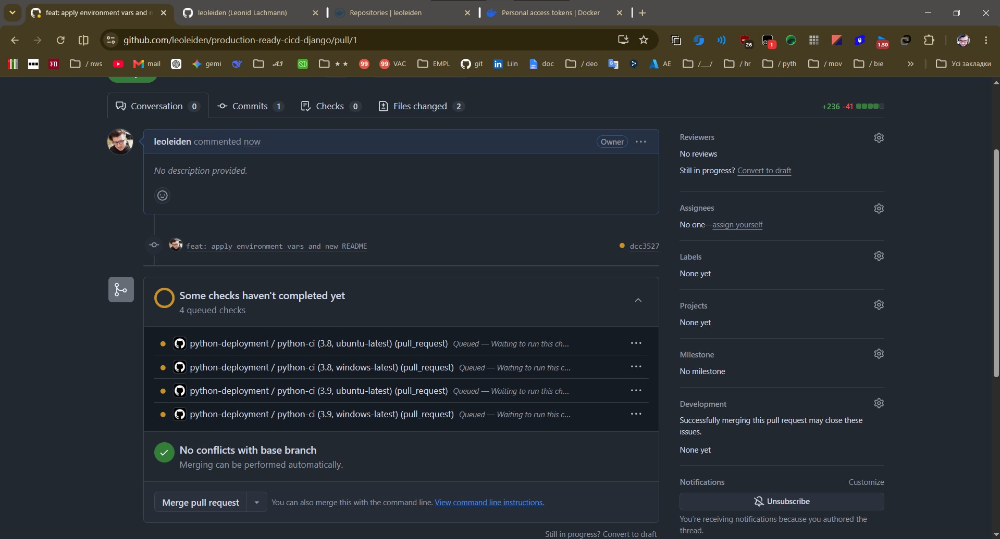
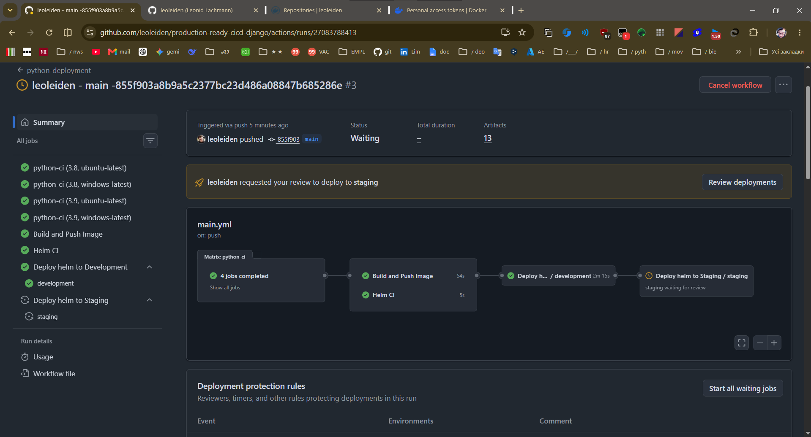
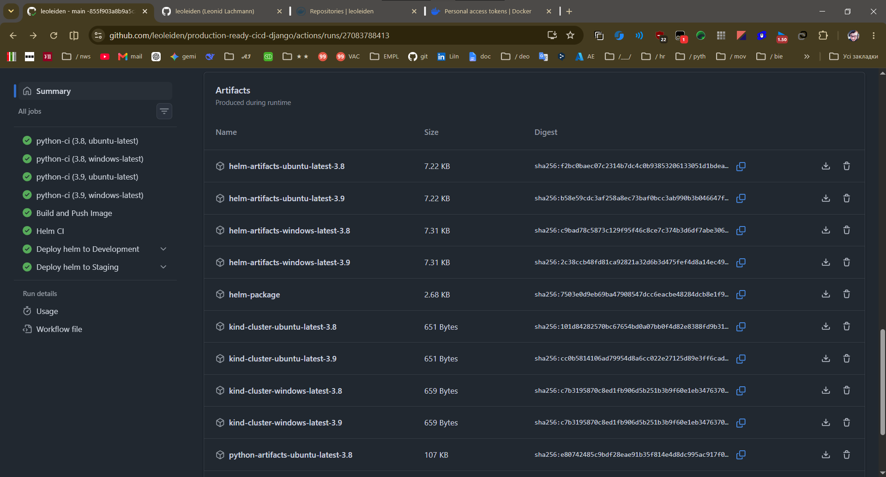

# 🚀 Production-Ready CI/CD & Kubernetes Deployment
**Architected and implemented by Leonid Lachmann**

This repository showcases a comprehensive, enterprise-grade CI/CD pipeline and Kubernetes deployment strategy for a monolithic Django web application. It transitions traditional deployments into a modern, automated, and scalable cloud-native workflow utilizing GitHub Actions, Docker, and Helm.

## ⚙️ DevOps Features & Architecture

### 🔄 Advanced CI/CD Pipeline (GitHub Actions)
* **Matrix Testing:** Engineered a complex testing matrix running unit tests across multiple Python versions (3.8, 3.9) and Operating Systems (Ubuntu, Windows) simultaneously.
* **Code Quality & Linting:** Automated test coverage reporting (`coverage`) and enforced code complexity limits using `flake8`.
* **Reusable Workflows:** Followed DRY principles by implementing `reusable-deployment.yml` to standardize Helm deployments across both `development` and `staging` environments.
* **Concurrency Control:** Implemented workflow concurrency limits and auto-cancellation of redundant in-progress runs to optimize runner resources.
* **Branch Protection & Governance:** Enforced strict branch protection on `main`, requiring successful status checks and Pull Requests before merging.
* **Manual Approvals:** Configured secure deployment gating with mandatory manual approvals for the `staging` environment.

### ☸️ Kubernetes & Helm Orchestration
* **Helm Chart Packaging:** Packaged the Django application and a MySQL StatefulSet into a cohesive Helm chart (`todoapp`) for templated, version-controlled deployments.
* **Environment Parity:** Managed environment-specific configurations via separate `values.yaml` and `stg.yaml` override files.
* **Ephemeral Testing Environments:** Integrated `kind` (Kubernetes IN Docker) within the CI/CD pipeline to spin up temporary clusters and perform dry-run Helm deployments before executing actual upgrades.
* **Cloud-Native Resources:** Configured comprehensive K8s manifests including `StatefulSet` for databases, `Deployment` for the app, `PersistentVolumeClaims` (PVC) for data retention, and `Ingress` for traffic routing.
* **Auto-Scaling & High Availability:** Configured Horizontal Pod Autoscaler (HPA) to scale application replicas based on CPU and memory utilization, ensuring strict SLA adherence during traffic spikes without resource over-provisioning.
* **Security & Workload Isolation:** Enforced least-privilege principles across workloads, establishing a secure baseline prepared for strict RBAC controls and network isolation requirements.
* **Secret Management & Compliance:** Secured sensitive database credentials and application keys by dynamically injecting GitHub Secrets during the `helm upgrade` process, ensuring zero credentials leakage in logs, code, or artifacts to meet enterprise compliance standards.

## 📊 Proof of Execution

The pipeline is fully operational. Below are demonstrations of the automated workflow, security checks, and deployment processes.

### 1. Matrix Testing & Workflow Success
*(This screenshot demonstrates the successful execution of the entire GitHub Actions pipeline, highlighting the matrix builds and artifact generation).*


### 2. Branch Protection & PR Status Checks
*(This screenshot verifies that branch protection rules are active, preventing direct merges to the main branch until all CI status checks are fully resolved).*


### 3. Manual Approval Gate for Staging
*(This screenshot illustrates the environment protection rules in action, showing the pipeline paused and awaiting manual authorization before deploying to the staging environment).*


### 4. Artifact Management & Retention
*(This screenshot highlights the automated generation and storage of distinct build artifacts, including Helm charts, K8s cluster configurations, and Python builds, corresponding to each matrix environment).*


## 🚀 Getting Started

To explore the Helm configurations or deploy this stack to your own cluster:

### Prerequisites
* [Docker](https://docs.docker.com/get-docker/) & [Kubernetes](https://kubernetes.io/docs/setup/) (e.g., Minikube, KinD, or a managed cloud K8s).
* [Helm](https://helm.sh/docs/intro/install/) package manager.

### Local Helm Deployment

1. **Clone the repository**
   ```bash
   git clone https://github.com/leoleiden/production-ready-cicd-django.git
   cd production-ready-cicd-django/helm-charts
   ```

2. **Install the Helm chart (Dry-run to test manifests)**
   ```bash
   helm install my-todoapp ./todoapp --dry-run
   ```

3. **Deploy to the cluster**
   ```bash
   helm install my-todoapp ./todoapp
   ```

---
*A special thanks to Illia Losiev for his mentorship, valuable feedback, and code reviews during the development of this infrastructure setup.*
